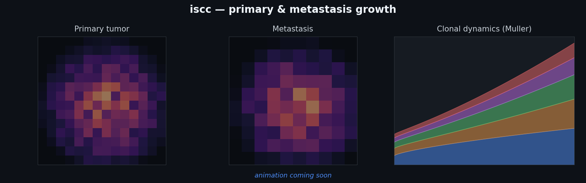

# **in silico** cancer center



*A primary tumor seeds a clonally-linked metastasis — watch both grids grow alongside their clonal
(Muller) dynamics. Live animation coming soon.*

`iscc` is an internally-consistent, multi-modal **tumor-evolution data simulator**. It grows one
selection-driven, spatially-structured tumor, optionally treats it, samples it (biopsy /
dissociation), and generates single-cell and bulk **DNA / RNA / spatial** data — down to sequencing
reads — all sharing the *same* ground truth.

It is the rename and expansion of the earlier `tumorevo` package.

## Why iscc

- **One consistent tumor, every modality.** DNA, RNA, and spatial data are emitted from the *same*
  evolving cells, so cross-modal relationships (copy-number → expression, clone → niche) are coherent
  rather than bolted on.
- **Ground truth for benchmarking.** Every run knows the true clones, copy numbers, mutations, cell
  states, spatial niches, and lineage — the labels real data can never provide.
- **Calibrated to real data.** Assay parameters can be fit from a pilot dataset, and the shipped
  defaults sit inside a characterized *operating envelope* of realistic tumors.

## The pipeline

`iscc` is a staged pipeline, each stage a command-line tool:

| Stage | CLI | Does |
|---|---|---|
| 1. Grow | `isccsim` | grow a tumor; write ground-truth genotypes / CNVs / expression / spatial state |
| 2. Sample | `isccsample` | biopsy / dissociate the tumor into a sample of cells |
| 3. Assay | `isccdata` | generate single-cell & bulk DNA/RNA and spatial-transcriptomics data |
| viz | `isccfig`, `isccgif` | Muller plot, 2D slice, clone tree, and growth animations |

## Quickstart

```bash
pip install iscc
isccsim --sim-config config.yaml --steps 2000 --random-seed 0 -o sim_out
```

The shipped defaults produce a realistic multi-clone tumor. See
[Parameters & defaults](parameters.md) for each knob's default, valid range, and what going out of
range does — plus `tumor.diagnose()`, which flags a degenerate tumor after growth and tells you which
knob to turn.

## Where to next

- [Installation](installation.md)
- [Parameters & defaults](parameters.md) — defaults, valid ranges, and the built-in QC diagnostic
- [Output schema](schema.md) — what each stage writes
- **Tutorials** — start with the [pipeline walkthrough](tutorials/01_pipeline_walkthrough.ipynb)
